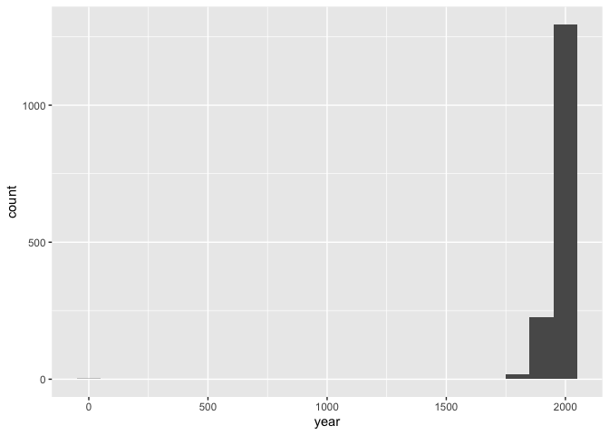
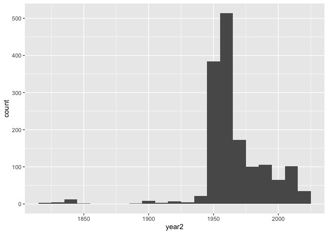
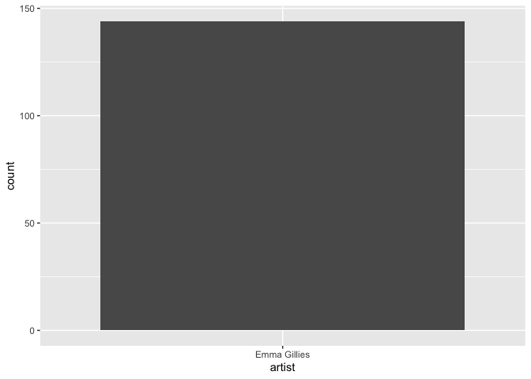

Lab 07 - University of Edinburgh Art Collection
================
Alex Connolly
3-16-22

### Load packages and data

``` r
library(tidyverse) 
library(skimr)
library(robotstxt)
```

``` r
paths_allowed("https://collections.ed.ac.uk/art)")
```

    ## collections.ed.ac.uk

    ## Warning in request_handler_handler(request = request, handler = on_not_found, :
    ## Event: on_not_found

    ## Warning in request_handler_handler(request = request, handler =
    ## on_file_type_mismatch, : Event: on_file_type_mismatch

    ## Warning in request_handler_handler(request = request, handler =
    ## on_suspect_content, : Event: on_suspect_content

    ## 

    ## [1] TRUE

``` r
# Remove eval = FALSE or set it to TRUE once data is ready to be loaded
uoe_art <- read_csv("data/uoe-art.csv")
```

### Exercise 9

``` r
uoe_art <- uoe_art %>%
  separate(title, into = c("title", "date"), sep = "\\(") %>%
  mutate(year = str_remove(date, "\\)") %>% as.numeric()) %>%
  select(title, artist, year, link)
```

    ## Warning: Expected 2 pieces. Additional pieces discarded in 37 rows [213, 286,
    ## 311, 371, 441, 581, 754, 781, 917, 949, 974, 1003, 1021, 1132, 1162, 1231, 1273,
    ## 1290, 1450, 1476, ...].

    ## Warning: Expected 2 pieces. Missing pieces filled with `NA` in 621 rows [6, 13,
    ## 21, 30, 43, 49, 54, 57, 66, 68, 69, 72, 73, 74, 76, 77, 81, 82, 89, 91, ...].

    ## Warning in str_remove(date, "\\)") %>% as.numeric(): NAs introduced by coercion

Its okay if we don’t have a year!

### Exercise 11

``` r
skim(uoe_art)
```

|                                                  |         |
|:-------------------------------------------------|:--------|
| Name                                             | uoe_art |
| Number of rows                                   | 2910    |
| Number of columns                                | 4       |
| \_\_\_\_\_\_\_\_\_\_\_\_\_\_\_\_\_\_\_\_\_\_\_   |         |
| Column type frequency:                           |         |
| character                                        | 3       |
| numeric                                          | 1       |
| \_\_\_\_\_\_\_\_\_\_\_\_\_\_\_\_\_\_\_\_\_\_\_\_ |         |
| Group variables                                  | None    |

Data summary

**Variable type: character**

| skim_variable | n_missing | complete_rate | min | max | empty | n_unique | whitespace |
|:--------------|----------:|--------------:|----:|----:|------:|---------:|-----------:|
| title         |         1 |          1.00 |   0 |  95 |     8 |     1338 |          0 |
| artist        |       114 |          0.96 |   2 |  55 |     0 |     1104 |          0 |
| link          |         0 |          1.00 |  58 |  61 |     0 |     2910 |          0 |

**Variable type: numeric**

| skim_variable | n_missing | complete_rate |    mean |    sd |  p0 |  p25 |  p50 |  p75 | p100 | hist  |
|:--------------|----------:|--------------:|--------:|------:|----:|-----:|-----:|-----:|-----:|:------|
| year          |      1368 |          0.53 | 1964.54 | 56.08 |   2 | 1953 | 1962 | 1980 | 2020 | ▁▁▁▁▇ |

114 have artist missing, 1368 has year missing

### Exercise 12

``` r
ggplot(data = uoe_art, aes(x = year)) + geom_histogram(binwidth = 100)
```

    ## Warning: Removed 1368 rows containing non-finite values (stat_bin).

<!-- -->

### Exercise 13

Because this is death mask (2), the code grabbed the 2 instead of the
1964

``` r
uoe_art <- uoe_art %>%
  mutate(
    year2 = if_else(year == 2, 1964, year)
  )
```

``` r
ggplot(data = uoe_art, aes(x = year2)) + geom_histogram(binwidth = 10)
```

    ## Warning: Removed 1368 rows containing non-finite values (stat_bin).

<!-- -->

### Exercise 14

``` r
uoe_artist <- uoe_art %>%
  filter(artist == "Emma Gillies")
ggplot(data = uoe_artist, aes(x = artist)) + geom_bar()
```

<!-- --> Unknown (duh) and Emma
Gillies had the most pieces of art. I know nothing about her.

### Exercise 15

``` r
uoe_art %>% 
  filter(
    str_detect(title , "child") |
      str_detect(title , "Child")
  )
```

    ## # A tibble: 10 × 5
    ##    title                                                artist  year link  year2
    ##    <chr>                                                <chr>  <dbl> <chr> <dbl>
    ##  1 "Woman with Child and Still Life "                   Cathe…  1938 http…  1938
    ##  2 "Untitled - Children Playing "                       Monik…  1963 http…  1963
    ##  3 "The Children's Hour "                               Eduar…    NA http…    NA
    ##  4 "Child's collar. Chinese"                            Unkno…    NA http…    NA
    ##  5 "Virgin and Child"                                   Unkno…    NA http…    NA
    ##  6 "Virgin and Child "                                  Unkno…    NA http…    NA
    ##  7 "Child's chinese headdress"                          Unkno…    NA http…    NA
    ##  8 "Virgin and Child "                                  Unkno…    NA http…    NA
    ##  9 "Figure Composition with Nurse and Child, and Woman… Edwar…    NA http…    NA
    ## 10 "The Sun Dissolves while Man Looks Away from the Un… Eduar…    NA http…    NA

there were 10 instances of child in the art
